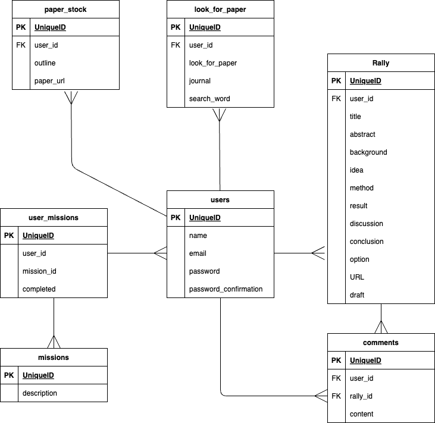

# アプリケーション名
Tech Rally

# アプリケーション概要
想定ユーザー：企業の開発職チーム

自分の読んだ論文などの技術資料をXやTeamsのようにチーム内で共有できるアプリ。ゲーミフィケーションの要素を取り入れ、技術情報収集を習慣化する仕組みを実装した。

# URL
https://techrally.onrender.com

# テスト用アカウント
・Basic認証ID：admin 
・Basic認証パスワード：2222 
・メールアドレス：sample2@email.com 
・パスワード：sample2

# 利用方法
## Rally投稿
Rally：論文の要約などをユーザーがまとめたもの
1. サイドバーの「投稿する」から投稿ページへ移動する。
2. 右上の「新規投稿」ボタンから投稿フォームへ移動し、各項目（タイトル、要約、意見、URLは必須）を埋めて「投稿する」をクリックする。下書き（非公開）で保存することも可能。

## コメント機能
1. トップページからRallyを選択し、詳細画面へ移動する。
2. Rally下部のコメント欄にコメントを記載し、「投稿ボタン」をクリック。

## ミッション機能
1. マイページから保有しているミッション（最大3つ）を確認できる。
2. ミッションに記載されているアクションを取ることでミッションを達成できる。

## ランキング機能
ランキングページから、Rallyの投稿数、コメントの投稿数、ミッションの達成数のランキングが確認できる。チーム内で競い合ったり、コミュニケーションのきっかけになることを想定している。

## 探したい論文機能
探したい論文の特徴や検索ワードをメモしておく機能です。
1. サイドバーの「探したい論文」から専用ページへ移動する。
2. 画面右のフォームに入力して「保存する」ボタンをクリック。

## 論文ストック機能
読みたい論文をストックしておく機能です。
1. サイドバーの「論文ストック」から専用ページへ移動する。
2. 画面右のフォームに入力して「保存する」ボタンをクリック。

# アプリケーションを作成した背景
企業の開発職として働いていた際、日頃から論文などの技術資料に触れ、知識習得・情報収集しておくことが重要であると感じる反面、習慣化する難しさを感じた。特にネタ探しやモチベーションの維持、時間の確保が課題として挙げられた。これらを解決するため、ミッションやランキングといったゲーム的な要素を取り入れ、楽しみながら学習できるようなアプリを開発することとした。ミッションはスキマ時間で達成できるように細分化したものを多数用意し、気づいた時には学習を習慣化できているようなアプリ設計を目指した。

# 実装予定の機能
・ユーザーにミッションを毎日配布する機能

# データベース設計

# 開発環境
・バックエンド：Ruby on Rails, PostgreSQL 
・フロントエンド：HTML5, CSS3 
・インフラ：Render 
・テスト：RSpec, Capybara, FactoryBot 
・テキストエディタ：Visual Studio Code

# ローカルでの動作方法
以下のコマンドを順に実行。
% git clone https://github.com/Pokesyoum/TechRally 
% cd TechRally 
% bundle install 
% rails db:create 
% rails db:migrate

# 工夫したポイント
ただの投稿アプリではなくミッションやランキングなどのゲーム的な要素を取り入れたアプリとした点。ミッションには完了フラグがあり、ミッション内容に相当するアクションを実行した際に、完了フラグが立つよう設定した。

# 改善点
複数のビューでビューファイルを流用しているが、わかりやすい形に切り出せていない部分があるので、部分テンプレート化する。コントローラー内のコードも同じように切り出してコードの整理をする必要がある。

# 制作時間
アプリの企画から実装まで3週間（1日の作業時間は2-3時間程度）。